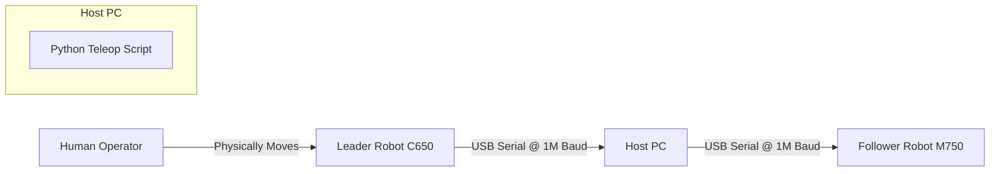

# System Architecture: MyArm Leader-Follower Teleoperation

## 1. System Overview
The **MyArm-Control** project implements a direct "Leader-Follower" teleoperation system between two Elephant Robotics robotic arms:
- **Leader**: MyArm C650 (6-axis + Gripper). Input device.
- **Follower**: MyArm M750 (6-axis + Gripper). Output device.

The system runs on a central Host PC (Linux) that communicates with both robots via USB Serial connections. No external network or TCP sockets are used for the core control loop.

## 2. Hardware Topology

## 3. Software Data Flow
The core control loop (inside `teleop_explicit.py`) operates at approximately 20-50Hz.

1.  **Read State (Leader)**: 
    - The script polls the C650 for current joint angles (`get_joints_angle()`).
    - Data: `[J1, J2, J3, J4, J5, J6, J7]` (Degrees).

2.  **Processing (the "Mapping Layer")**:
    - **Normalization**: The "Resting Position" offsets (`C650_HOME_ANGLES`) are subtracted from the raw readings.
    - **Inversion**: Specific joints (J2, J3) are inverted (`angle * -1`) to account for the physical mounting differences and motor directionality between the C and M series.
    - **Clamping**: Angles are clamped to strict software limits (defined in `config.py`) to prevent sending unsafe commands to the M750 (e.g., J2 must be in `[-80, 80]`).
    - **Gripper Mapping**: The C650's J7 angle (typically -88 to 10) is linearly mapped to the M750's gripper value range (0-100).

3.  **Command (Follower)**:
    - **Arm**: The calculated 6-axis angles are sent via `write_angles()`.
    - **Gripper**: The mapped gripper value is sent via `set_gripper_value()`.

## 4. Module Structure

### `control_scripts/`
- **`teleop_explicit.py`**: The main executable. Initializes connections and runs the infinite control loop.
- **`c650_motion_logger.py`**: A utility to record raw leader trajectories to CSV.
- **`*_range_monitor.py`**: Utilities for calibration, displaying real-time Min/Max values.

### `utils/`
- **`mapping.py`**: Pure logic functions. Handles all the math: `process_arm_angles()`, `process_gripper()`, `map_value()`. It relies on constants from `config.py`.
- **`connection.py`**: Hardware abstraction. Handles listing and selecting serial ports interactively.

### Root
- **`config.py`**: The "Single Source of Truth" for calibration.
    - **`C650_HOME_ANGLES`**: Defines the user's custom zero-point.
    - **`LEADER_GRIPPER_OPEN/CLOSED`**: Calibrated range for the specific input unit.
    - **`M750_LIMITS`**: Safety constraints.

## 5. Key Technical Decisions
- **Why `MyArmMControl`?**: The standard `MyArmM` class in `pymycobot` lacked explicit gripper methods (`set_gripper_value`). We switched to `MyArmMControl` to gain access to protocol codes `0x63` (Enable) and `0x66` (Set Value).
- **Why clamp J2?**: Empirical testing revealed the M750 firmware throws an exception (and disconnects) if Joint 2 receives a command < -80 degrees. The clamp ensures system stability.
